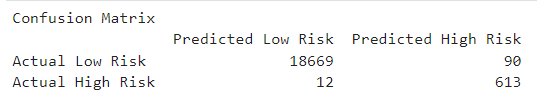
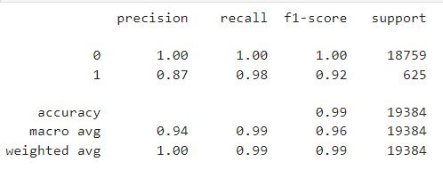
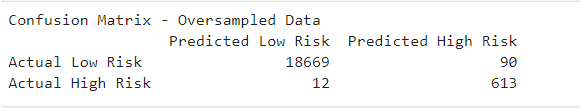
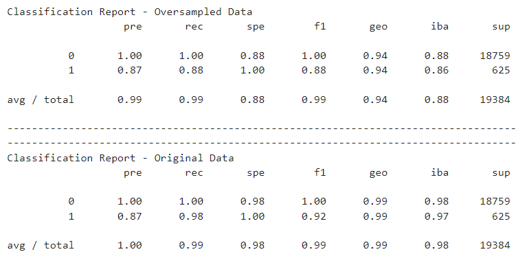

# Supervised Learning Module 12 - Evaluating Creditworthiness

## Purpose

The purpose of this challenge is to utilize the existing lending data to understand, model and classify the appropriate state of each of the loans in the portfolio. The data will look to analyze each of the independent variables to arrive at a predicted target variable of either a (i) low-risk loan status or (ii) whether it should be classified as a high risk loan.  

To arrive at the target variable, the model will analyze the following features ("independent variable") consisting of the following parameters:

* loan size
* interest rate
* borrower income
* debt-to-income ratio
* number of accounts held
* deragotory marks
* total debt 

The original data set had a value count of the following:

* Low Risk Loans: 75,036
* High Risk Loans: 2,500

The following machine learning modules will be utilize in this exercise:

* Logistic Regression 
* Logistic Regression with Resampled Over Sampled Training Data

In order to do so, we will perform a `train_test_split` function for each of the models using a `random_state=1` to hold the random generation environment constant. Most importantly, prior to beginning, we will be using our `StandardScaler` function to normalize and standardize the data for an `apples-to-apples` comparison. 

## Machine Learning Models

### *Logistic Regression* 

* Balanced Accuracy Score: 98.8%

* Confusion Matrix 

* Classification Report 

The balanced accuracy report reflects a 98.8% balanced accuracy score, indicating that 98.8% of the data in the test data were accurately categorized. Further, as it relates to the confusion matrix, the true negatives and true positives are at the higher end of each respective positions and are extremely far away from the false positives and false negatives. However, the confusion matrix do represents a large disparity when summing individually the rows and columns, as the numbers are not close to equally out. Thus, precision, accuracy and recall could be susceptible. 

Noteworthy, the level of low-risk loans greatly outweigh the high-risk loans, as the high-risk loan population only represents 3.3% (or 2,500 out of 77,5360), which ws confirmed through the `value-count` function. Therefore, the model could potentially be prepositioned to predict more low-risk loans. On the other hand, the classifiction report indicates a 92% accuracy for predicting loans that could potentially be high-risk.  Within the high-risk populuation, the recall was 98% reflecting a low percentage of predicted false negatives. Of that, the precision within the respective population was 87% of the time on the recalls.  Nonetheless, logistic regression model would need to be tested and validated more. 

A recommendation to explore other functions to determine and compare whether the logistics regression is more or less ideal function to assess the healthiness of the loan portfolio due to the large disparity and imbalance of the data set.

### *Logistic Regression with Resampled Over Sampled Training Data*

As previously mentioned, we had an imbalanced on the target label when analyzing the value counts.  In this machine learning technique, we will look to sample the minority class ('high risk loans') with a greater-than-random chance by performing an oversampling analysis on imbalanced data.  Therefore, we will import our `RandomOverSampler` function from the `imblearn.over_sampling` library. We will still continue to keep our `random_state=1` to hold this random state constant.  As such, we will oversampled our data, which generated an equal value count of 56,277.  From there will perform our model, fit, predict functions yielding the following results. 

* Balanced Accuracy Score: 93.7%

* Confusion Matrix - Oversampled Data

* Classification Imbalanced Report Comparison 

## Summary of Results

The original data had a higher recall with a 98.8% effectiveness on capturing high risk loans. Thus, indicating that of all the loans that are actually high-risk, 98.8% of this would be caught correctly by the model. Therefore, a much better recall percentage than the oversampled data of 88%. 

When looking at precision of both the original data and the oversampled data, precision is equal at 87%. Therefore, illustrating that of all the high risk loans captured and predicted, the model would be predicting the same level of false positives. Since neither is lower than the other, the original data represented above would be more favorable to use, since it outperform in both, accuracy and recall. The recommendation would be to utilize the Logistics Regression model on the original data set, as it had a better accuracy and recall profile than the oversampling set. The original data set had a higher recall of 98% suggesting that it will do a better job of catching potential defaults, as opposed to 88% on the oversampled data. 

At most lending institutions, typically, there are a smaller amount of loans that are considered high-risk in nature, when compared to that of low-risk.  Most lending institutions pride themselves on being prudent in their lending practices and would typically shy aware from approving and originating high-risk loans at origination. Thus, the imbalanced characteristics and performance should be reflective of most lending institutions credit portfolio (3.3% as mentioned above). 

More importantly, financial institutions would not make a conscious lending practice to approve or have an equal amounts of high-risk loans and low-risk loans. Most high-risk loans performance typically move into this category over time as a result of external factors after loan origination as a result of changes in individual borrower statistics, such as credit score deterioration, sources of repayment deterioration and other micro/macro-economic factors such as declining collateral values that may impact the borrower's ability to repay their debt obligations. When looking at the overall health of a loan portfolio, recall (such as false negatives) are extremely undesirable, as that would translate to incorrecly identifying a loan as low-risk and not catching high-risk loans in a timely-manner to mitigate the risk.  False negatives in a lending portfolio would prove to be extremely costly and lead to non-performing, non-accruing loans that could ultimately result in writedowns and/or potential foreclosures. Therefore, those high-risk loans need to be identified appropriately within the model. Thus, the orignal data set outperformed the oversampled data when utilizing this measure. 